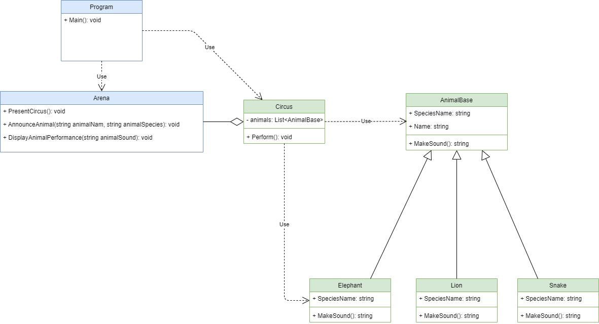

# Grand Circus

## Circus

Create a Console Application that will have a `Circus` class.

The `Circus` is using an Arena instance and a collection of animals.

- The `Arena` instance is part of the presentation layer. It contains details of how the data is displayed to the user. The `Arena` is received from outside (see the provided code)

- On the other hand, the collection of animals is managed internally. The animals are created and kept inside `Circus` class.

## Animals
As any respectful circus, it must have a collection of animals. All animals have common attributes and behaviors. We can model them by using inheritance. Let’s create an abstract class, `AnimalBase`.

All the animals are born in captivity, in the `Circus`, and each animal receives a name at birth (`Name` property), that cannot be changed.

> **Hints**
> 
> - Find a way to ensure that the name of the animal will not be changed after the object is created.

Each animal belongs to a species (`SpeciesName` property). This property cannot be changed. Each animal must provide this value. It cannot be set from outside and cannot be changed. It is the nature of each animal. It is, however, visible. It must be easy to obtain this information from the animal.

> **Hints**
>
> - Find a way to avoid duplicating the implementation of the `Name` and `SpeciesName` properties in each class.
>
> - Find a way to ensure that the `Name` and `SpeciesName` are mandatory for each animal.

## Circus Performance

Having said this, the `Circus` can now perform. The performance consists in bringing every animal, one by one, to the arena, announce them and provoke them to make a sound. I know, it is kind of a lousy circus, but this is all it is necessary to receive prize in the beginning of the world of learning… Remote Learning, I mean.

## Hints

The needed classes:

- `Arena` - It is responsible to display the messages in the console (Presentation Layer).

- `Circus` - It is responsible to manage the collection of animals.

- `AnimalBase` - Represents an animal. It is the abstracted idea of an animal. Contains common functionality that must be present for all the animals.

- Some animals: 
  - `Elephant` - A concrete implementation of an animal.
  - `Lion` - Another concrete implementation of an animal.
  - `Snake` - Yet another concrete implementation of an animal.
  - Be creative with more animals :)

## Class Diagram (Hint)

