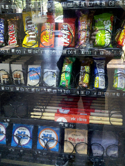

# Vending Machine

*"A vending machine is an automated machine that provides items such as snacks, beverages, alcohol, cigarettes and lottery tickets to consumers after money or a credit card is inserted into the machine."* [*https://en.wikipedia.org/wiki/Vending_machine*](https://en.wikipedia.org/wiki/Vending_machine)

## Products

The vending machine will offer Products. A product has the following attributes:

- Name
- Price
- Quantity

## Shelf

The vending machine has a Shelf that contains all the products.

- The shelf will dispense one product as a result of a payment.
- The shelf is organized in columns. Each column contains only one type of product.
- Each column is identified by a number that will be used when placing the order.

## Numeric Keyboard

The vending machine has a Numeric Keyboard that can be used to request a product.

- To place an order, the client must type the number of the column where is the wanted product.

## Payment

Before obtaining a product from the machine, a Payment must be made. The vending machine should support the following payment methods:

- With cash: coins/banknotes
- With credit card

Payment flow:

1. The client specifies the selected product by typing on the numeric keyboard the column number of the product.
2. The client selects the payment method: Cash or Credit Card.
3. The client pays the necessary amount.
4. The machine gives back change if needed.
5. The product is dispensed

## Reports

In order to analyse the profitability of the vending machine, an admin can generate Reports in xml or json format.

- Report types:
  - Stock Report (product, current quantity)
  - Sales Report (date, product, price, payment-method)
  - Volume Report (product, total quantity)
- The Sales and Volume reports must be generated for a specific range of days.
- The Stock report is generated for the moment of the request.

## Supply Products

The admin should be able to Supply the vending machine with products.

- If the admin wants just to increase the quantity of an existing product, the following information must be provided:
  - column id 
  - quantity.

- If the admin wants to add a new product or replace an existing one, the full information must be provided:
  - column id
  - product name
  - price
  - quantity

## Admin User

The admin is not able to buy products, but he is able to see the list of existing products.

For the admin to access the reporting or the supply flows an authentication mechanism must be implemented.
